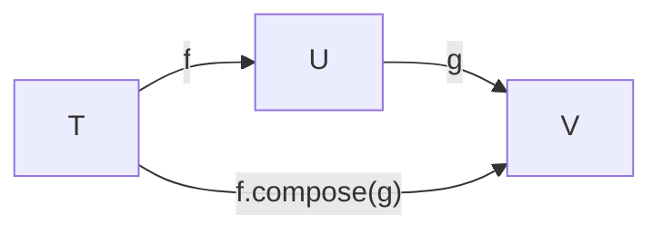
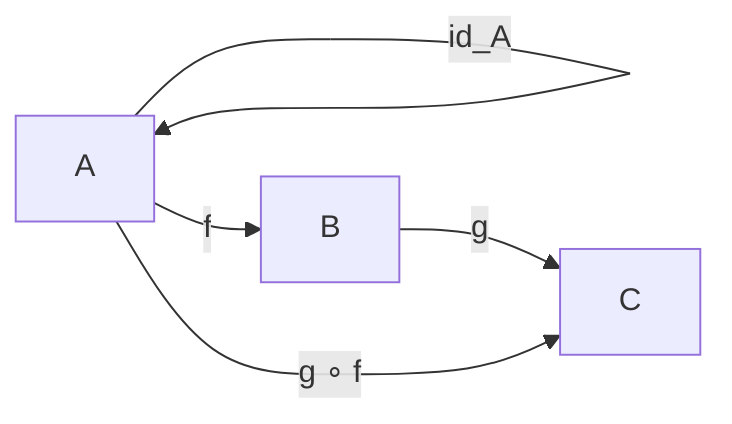
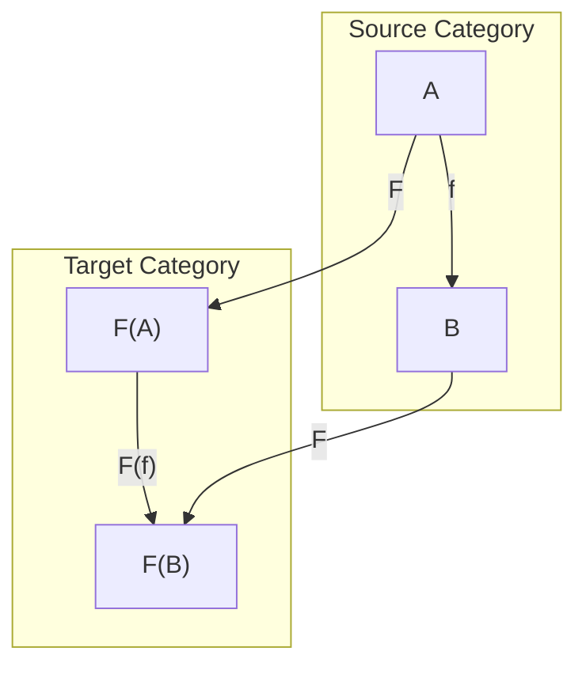
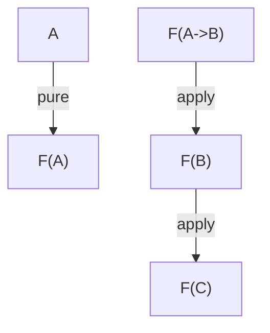
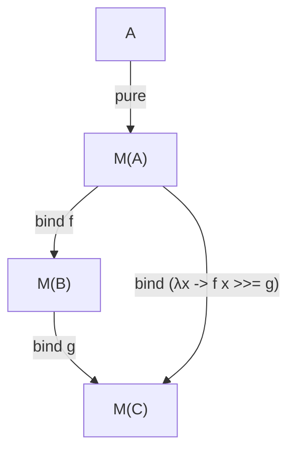

# Category Theory in Rustica

This document explains the core category theory concepts implemented in Rustica and their relationships.

## Type System Foundation

### Higher-Kinded Types (HKT)

The foundation of Rustica's type system is the `HKT` trait, which enables type-level programming:

```rust
pub trait HKT {
    type Output<U>: TypeConstraints where U: TypeConstraints;
}
```

All types in Rustica's functional abstractions must satisfy `TypeConstraints`:
- `Clone`, `Debug`, `PartialEq`, `Eq`, `Default`, `Send`, `Sync`, `'static`

## Core Abstractions

### Composable Functions

The `Composable` trait provides function composition capabilities:

```rust
pub trait Composable {
    fn compose<T, U, V, F, G>(f: F, g: G) -> FnType<T, V>;
}
```

Laws:
1. Identity: `f.compose(identity) = f = identity.compose(f)`
2. Associativity: `f.compose(g).compose(h) = f.compose(g.compose(h))`
3. Type Safety: `f: T -> U`, `g: U -> V`, then `f.compose(g): T -> V`
4. Order Preservation: `f.compose(g)(x) = g(f(x))`



### Category

A category in Rustica consists of:
1. Objects (Types satisfying `TypeConstraints`)
2. Morphisms (Functions between types)
3. Identity morphisms
4. Composition of morphisms

```rust
pub trait Category: Composable {
    type Morphism<A, B>: FnTrait<A, B> where A: TypeConstraints, B: TypeConstraints;
    
    fn identity_morphism<A: TypeConstraints>() -> Self::Morphism<A, A>;
    fn compose_morphisms<A, B, C>(f: Self::Morphism<A, B>, g: Self::Morphism<B, C>) -> Self::Morphism<A, C>;
}
```



### Functor

A functor maps between categories while preserving structure:

```rust
pub trait Functor<T>: HKT where T: TypeConstraints {
    fn fmap<U, F>(self, f: F) -> Self::Output<U>;
}
```

Laws:
1. Identity: `fmap id = id`
2. Composition: `fmap (f . g) = fmap f . fmap g`
3. Structure Preservation: `fmap` must preserve container structure
4. Type Safety: `fmap` must maintain the same type constructor



### Applicative

Applicative functors add the ability to apply functions within a context:

```rust
pub trait Applicative<T>: Functor<T> + Pure<T> where T: TypeConstraints {
    fn apply<U, F>(self, f: Self::Output<F>) -> Self::Output<U>;
    fn lift2<B, C, F>(self, b: Self::Output<B>, f: F) -> Self::Output<C>;
    fn lift3<B, C, D, F>(self, b: Self::Output<B>, c: Self::Output<C>, f: F) -> Self::Output<D>;
}
```

Laws:
1. Identity: `pure(id).apply(v) = v`
2. Composition: `pure(compose).apply(u).apply(v).apply(w) = u.apply(v.apply(w))`
3. Homomorphism: `pure(f).apply(pure(x)) = pure(f(x))`
4. Interchange: `u.apply(pure(y)) = pure(|f| f(y)).apply(u)`
5. Naturality: `fmap(f)(x.apply(y)) = x.apply(fmap(|g| f.compose(g))(y))`



### Monad

Monads add sequencing capabilities to applicative functors:

```rust
pub trait Monad<T>: Applicative<T> where T: TypeConstraints {
    fn bind<U, F>(self, f: F) -> Self::Output<U>;
    fn join<U>(self) -> Self::Output<U> where T: Into<Self::Output<U>>;
}
```

Laws:
1. Left Identity: `pure(x).bind(f) = f(x)`
2. Right Identity: `m.bind(pure) = m`
3. Associativity: `m.bind(f).bind(g) = m.bind(|x| f(x).bind(g))`
4. Join Consistency: `m.bind(f) = m.fmap(f).join()`
5. Pure Preservation: `join(pure(pure(x))) = pure(x)`



## Example: Maybe Monad

```rust
use rustica::datatypes::maybe::Maybe;
use rustica::traits::monad::Monad;
use rustica::traits::pure::Pure;
use rustica::fntype::FnType;

let x = Maybe::Just(3);
let f = FnType::new(|x| Maybe::Just(FnType::new(|x: i32| x + 1)));
let g = FnType::new(|x| Maybe::Just(FnType::new(|x: i32| x * 2)));

// Left identity
assert_eq!(Maybe::pure(3).bind(f.clone()), f.call(3));

// Right identity
assert_eq!(x.clone().bind(FnType::new(Maybe::pure)), x);

// Associativity
assert_eq!(x.clone().bind(f.clone()).bind(g.clone()), 
          x.bind(FnType::new(move |y| f.call(y).bind(g.clone()))));
```

## Further Reading

- [Haskell's Category Theory](https://wiki.haskell.org/Category_theory)
- [Cats Documentation](https://typelevel.org/cats/)
