# Category Theory in Rustica

This document explains the core category theory concepts implemented in Rustica, organized by related trait groups.

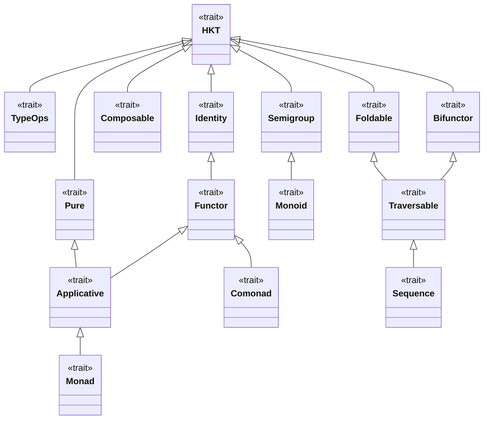
```mermaid
classDiagram
    class HKT {
        <<trait>>
    }
    class TypeOps {
        <<trait>>
    }
    class Identity {
        <<trait>>
    }
    class Composable {
        <<trait>>
    }
    class Functor {
        <<trait>>
    }
    class Bifunctor {
        <<trait>>
    }
    class Pure {
        <<trait>>
    }
    class Applicative {
        <<trait>>
    }
    class Monad {
        <<trait>>
    }
    class Comonad {
        <<trait>>
    }
    class Semigroup {
        <<trait>>
    }
    class Monoid {
        <<trait>>
    }
    class Foldable {
        <<trait>>
    }
    class Traversable {
        <<trait>>
    }
    class Sequence {
        <<trait>>
    }

    HKT <|-- TypeOps
    HKT <|-- Identity
    HKT <|-- Composable
    Identity <|-- Functor
    HKT <|-- Bifunctor
    HKT <|-- Pure
    Functor <|-- Applicative
    Pure <|-- Applicative
    Applicative <|-- Monad
    Functor <|-- Comonad
    HKT <|-- Semigroup
    Semigroup <|-- Monoid
    HKT <|-- Foldable
    Bifunctor <|-- Traversable
    Foldable <|-- Traversable
    Traversable <|-- Sequence
```

## Type System Foundation

### Base Types (HKT and TypeOps)

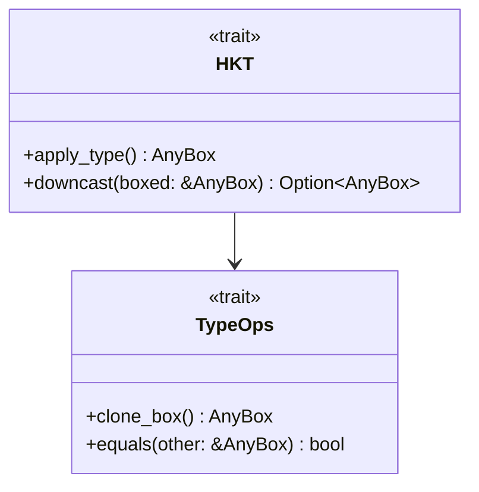
```mermaid
classDiagram
    class HKT {
        <<trait>>
        +apply_type() AnyBox
        +downcast(boxed: &AnyBox) Option~AnyBox~
    }
    class TypeOps {
        <<trait>>
        +clone_box() AnyBox
        +equals(other: &AnyBox) bool
    }
    HKT --> TypeOps
```

```rust
pub trait HKT: Send + Sync {
    fn apply_type(&self) -> AnyBox;
    fn downcast(&self, boxed: &AnyBox) -> Option<AnyBox>;
}

pub trait TypeOps: Any + Send + Sync {
    fn clone_box(&self) -> AnyBox;
    fn equals(&self, other: &AnyBox) -> bool;
}
```

These traits form the foundation of Rustica's type system, enabling higher-kinded types and type-level operations.

## Core Category Theory

### Identity and Composition (Identity, Composable)

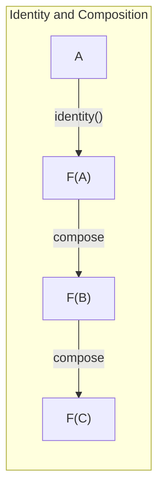
```mermaid
flowchart LR
    subgraph "Identity and Composition"
        A["A"] -->|"identity()"| FA["F(A)"]
        FA -->|"compose"| FB["F(B)"]
        FB -->|"compose"| FC["F(C)"]
    end
```

```rust
pub trait Identity: HKT {
    fn identity(&self) -> AnyBox;
    fn map_identity(&self, f: Arc<dyn Fn(AnyBox) -> AnyBox + Send + Sync>) -> AnyBox;
}

pub trait Composable: HKT {
    fn compose(&self, other: AnyBox) -> AnyBox;
}
```

### Functor and Bifunctor

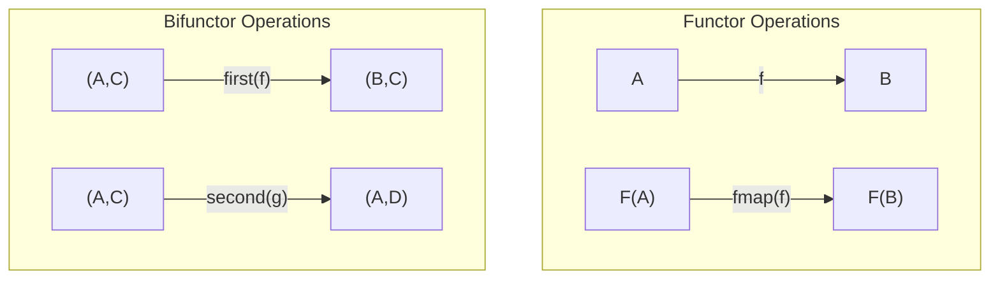
```mermaid
flowchart TB
    subgraph "Functor Operations"
        A["A"] -->|"f"| B["B"]
        FA["F(A)"] -->|"fmap(f)"| FB["F(B)"]
    end
    subgraph "Bifunctor Operations"
        direction LR
        P1["(A,C)"] -->|"first(f)"| P2["(B,C)"]
        P3["(A,C)"] -->|"second(g)"| P4["(A,D)"]
    end
```

```rust
pub trait Functor: Identity {
    fn fmap(&self, f: Arc<dyn Fn(AnyBox) -> AnyBox + Send + Sync>) -> AnyBox;
}

pub trait Bifunctor: HKT {
    fn first<F>(&self, f: Arc<F>) -> AnyBox where F: Fn(AnyBox) -> AnyBox + Send + Sync;
    fn second<F>(&self, f: Arc<F>) -> AnyBox where F: Fn(AnyBox) -> AnyBox + Send + Sync;
}
```

### Applicative and Pure

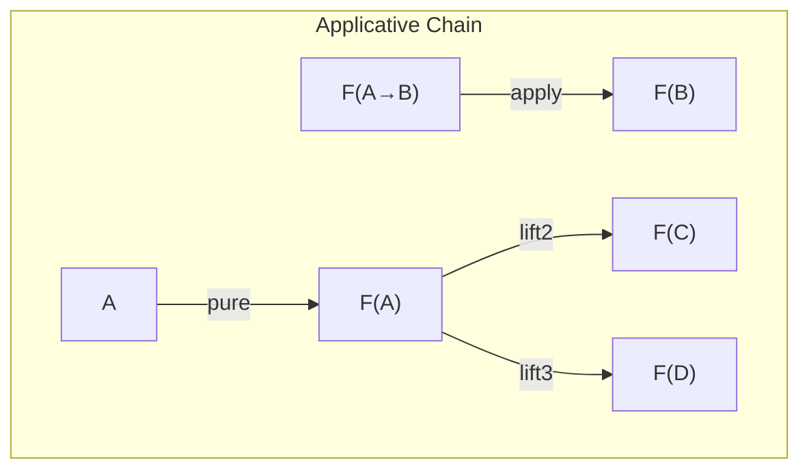
```mermaid
flowchart TB
    subgraph "Applicative Chain"
        A["A"] -->|"pure"| FA["F(A)"]
        FAB["F(A→B)"] -->|"apply"| FB["F(B)"]
        FA -->|"lift2"| FC["F(C)"]
        FA -->|"lift3"| FD["F(D)"]
    end
```

```rust
pub trait Pure: HKT {
    fn pure(&self, value: AnyBox) -> AnyBox;
}

pub trait Applicative: Functor + Pure {
    fn apply(&self, f: AnyBox) -> AnyBox;
    fn lift2(&self, b: AnyBox, f: Arc<dyn Fn(AnyBox, AnyBox) -> AnyBox + Send + Sync>) -> AnyBox;
    fn lift3(&self, b: AnyBox, c: AnyBox, f: Arc<dyn Fn(AnyBox, AnyBox, AnyBox) -> AnyBox + Send + Sync>) -> AnyBox;
}
```

### Monad and Comonad

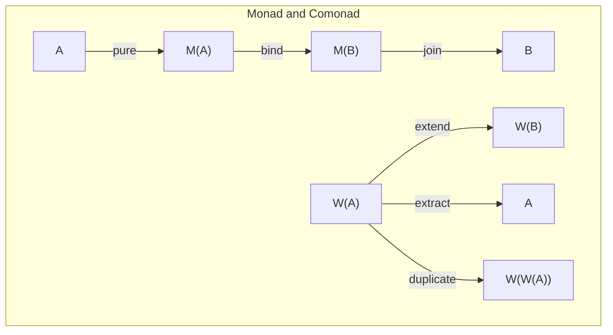
```mermaid
flowchart TB
    subgraph "Monad and Comonad"
        direction LR
        A["A"] -->|"pure"| MA["M(A)"]
        MA -->|"bind"| MB["M(B)"]
        MB -->|"join"| B["B"]
        
        WA["W(A)"] -->|"extend"| WB["W(B)"]
        WA -->|"extract"| A2["A"]
        WA -->|"duplicate"| WWA["W(W(A))"]
    end
```

```rust
pub trait Monad: Applicative {
    fn bind(&self, f: Arc<dyn Fn(AnyBox) -> AnyBox + Send + Sync>) -> AnyBox;
    fn join(&self) -> AnyBox;
}

pub trait Comonad: Functor {
    fn extract(&self) -> AnyBox;
    fn extend(&self, f: Arc<dyn Fn(AnyBox) -> AnyBox + Send + Sync>) -> AnyBox;
    fn duplicate(&self) -> AnyBox;
}
```

## Algebraic Structures

### Semigroup and Monoid

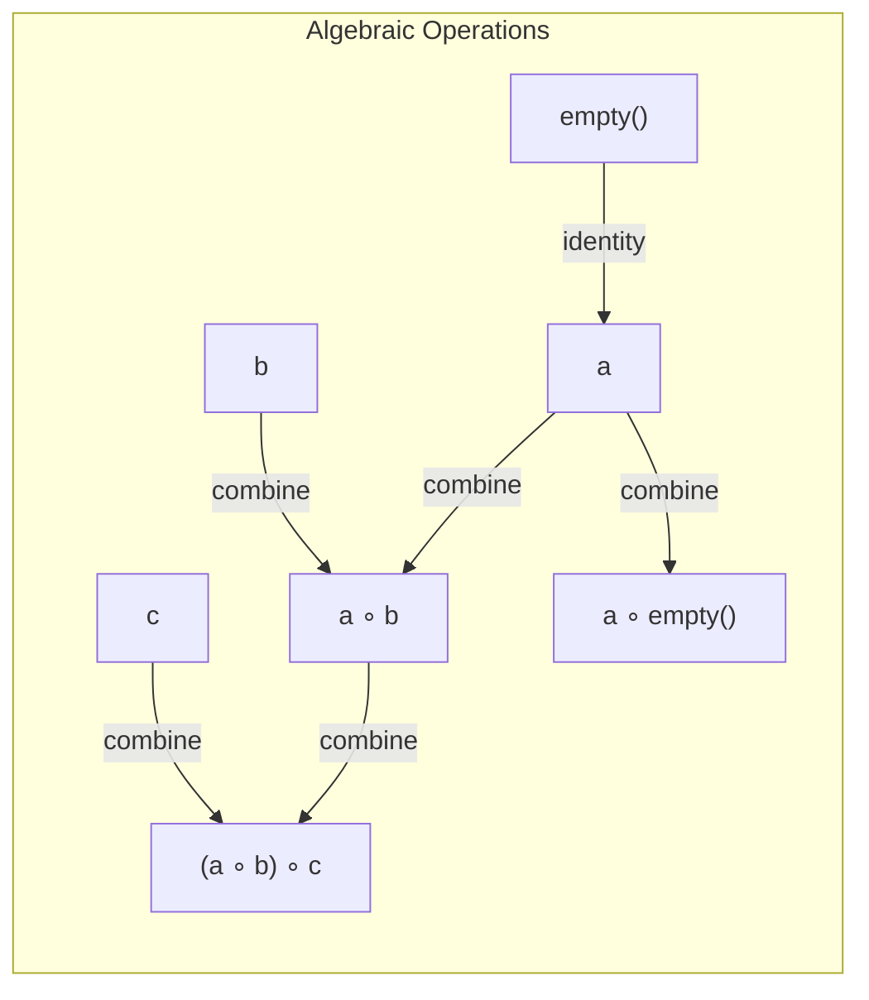
```mermaid
flowchart LR
    subgraph "Algebraic Operations"
        A["a"] -->|"combine"| AB["a ∘ b"]
        B["b"] -->|"combine"| AB
        AB -->|"combine"| ABC["(a ∘ b) ∘ c"]
        C["c"] -->|"combine"| ABC
        
        E["empty()"] -->|"identity"| A
        A -->|"combine"| AE["a ∘ empty()"]
    end
```

```rust
pub trait Semigroup: HKT {
    fn combine(&self, other: AnyBox) -> AnyBox;
    fn combine_all<I>(&self, iter: I) -> Option<AnyBox> where I: Iterator<Item = AnyBox>;
}

pub trait Monoid: Semigroup {
    fn empty(&self) -> AnyBox;
}
```

## Traversal Structures

### Foldable and Traversable

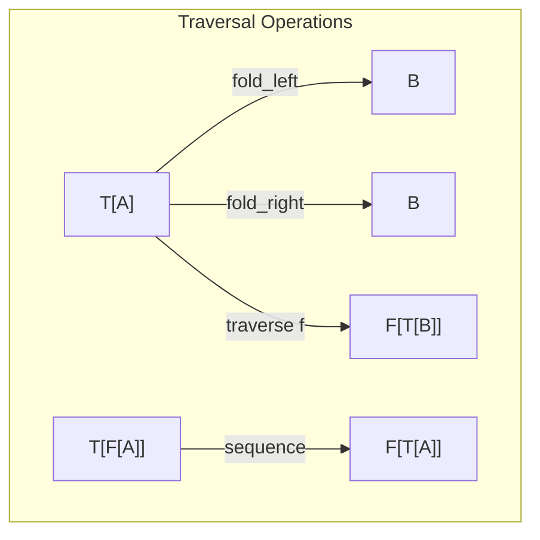
```mermaid
flowchart TB
    subgraph "Traversal Operations"
        TA["T[A]"] -->|"fold_left"| B["B"]
        TA -->|"fold_right"| B2["B"]
        TA -->|"traverse f"| FTB["F[T[B]]"]
        TFA["T[F[A]]"] -->|"sequence"| FTA["F[T[A]]"]
    end
```

```rust
pub trait Foldable: HKT {
    fn fold_left(&self, init: AnyBox, f: Arc<dyn Fn(AnyBox, AnyBox) -> AnyBox + Send + Sync>) -> AnyBox;
    fn fold_right(&self, init: AnyBox, f: Arc<dyn Fn(AnyBox, AnyBox) -> AnyBox + Send + Sync>) -> AnyBox;
    fn fold_map(&self, f: Arc<dyn Fn(AnyBox) -> AnyBox + Send + Sync>) -> AnyBox;
}

pub trait Traversable: Bifunctor + Foldable {
    fn traverse<F>(&self, f: Arc<F>) -> AnyBox where F: Fn(AnyBox) -> AnyBox + Send + Sync + 'static;
    fn distribute(&self) -> AnyBox;
}

pub trait Sequence: Traversable {
    fn sequence(&self) -> AnyBox;
}
```

## Common Implementations

### Option Example

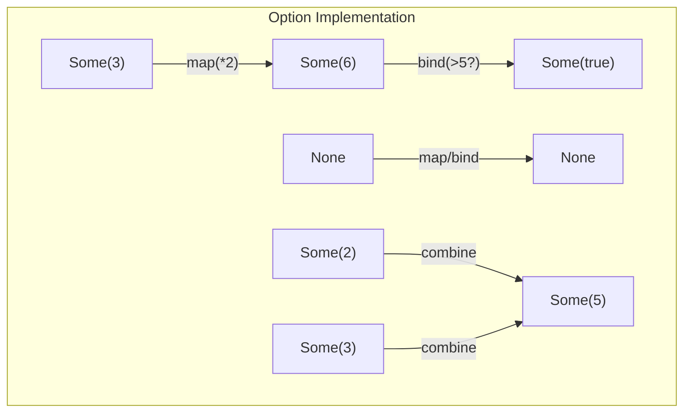
```mermaid
flowchart TB
    subgraph "Option Implementation"
        Some3["Some(3)"] -->|"map(*2)"| Some6["Some(6)"]
        Some6 -->|"bind(>5?)"| SomeTrue["Some(true)"]
        None -->|"map/bind"| None2["None"]
        
        Some["Some(2)"] -->|"combine"| SomeComb["Some(5)"]
        Some3_2["Some(3)"] -->|"combine"| SomeComb
    end
```

### Result Example

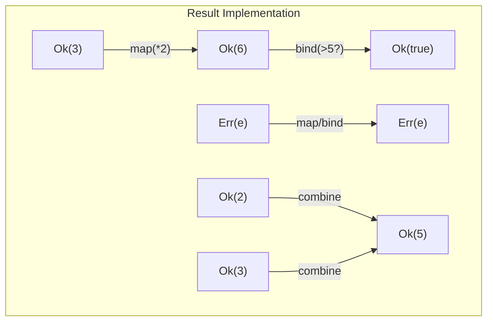
```mermaid
flowchart TB
    subgraph "Result Implementation"
        Ok3["Ok(3)"] -->|"map(*2)"| Ok6["Ok(6)"]
        Ok6 -->|"bind(>5?)"| OkTrue["Ok(true)"]
        Err["Err(e)"] -->|"map/bind"| Err2["Err(e)"]
        
        Ok["Ok(2)"] -->|"combine"| OkComb["Ok(5)"]
        Ok3_2["Ok(3)"] -->|"combine"| OkComb
    end
```

## Laws and Properties

### Core Laws

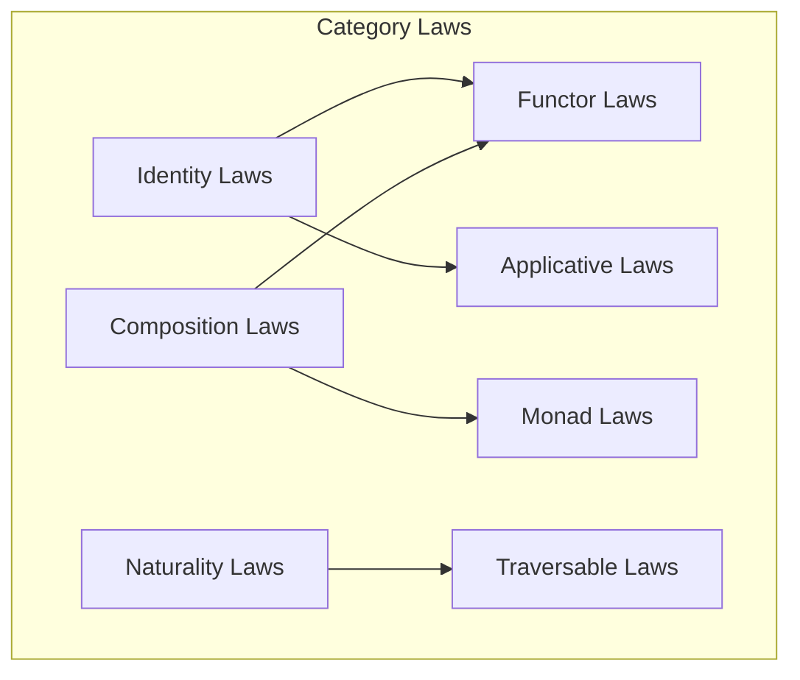
```mermaid
flowchart TB
    subgraph "Category Laws"
        Identity["Identity Laws"]
        Composition["Composition Laws"]
        Naturality["Naturality Laws"]
        
        Identity --> Functor["Functor Laws"]
        Identity --> Applicative["Applicative Laws"]
        Composition --> Functor
        Composition --> Monad["Monad Laws"]
        Naturality --> Traversable["Traversable Laws"]
    end
```

### Property Testing

Each trait's laws are enforced through property-based testing:

```rust
#[test]
fn test_functor_laws() {
    // Identity: fmap(id) == id
    // Composition: fmap(f . g) == fmap(f) . fmap(g)
}

#[test]
fn test_monad_laws() {
    // Left Identity: return a >>= f == f a
    // Right Identity: m >>= return == m
    // Associativity: (m >>= f) >>= g == m >>= (\x -> f x >>= g)
}
```

## Further Reading

- [Haskell's Category Theory](https://wiki.haskell.org/Category_theory)
- [Cats Documentation](https://typelevel.org/cats/)