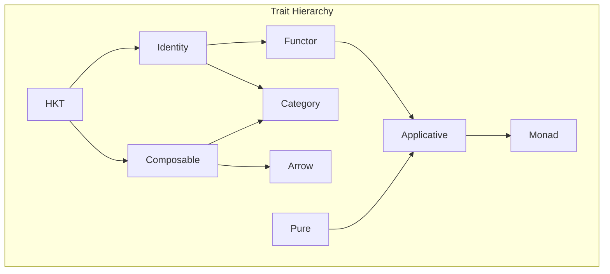
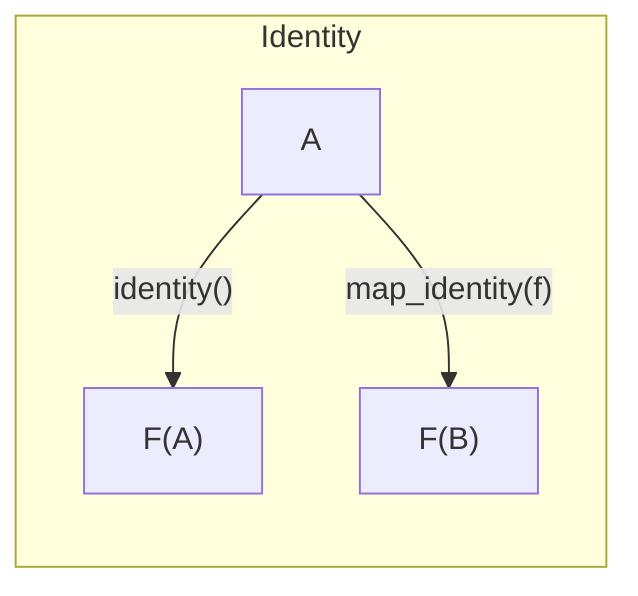
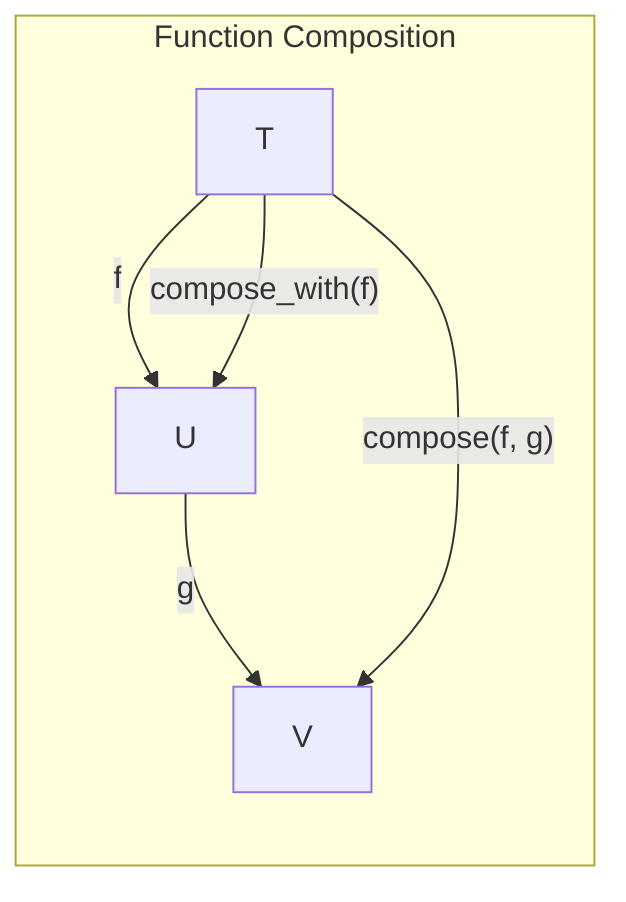
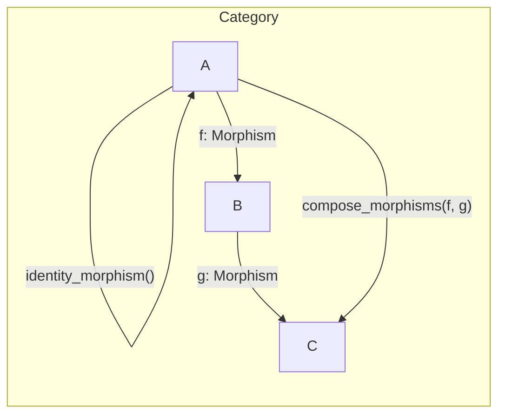
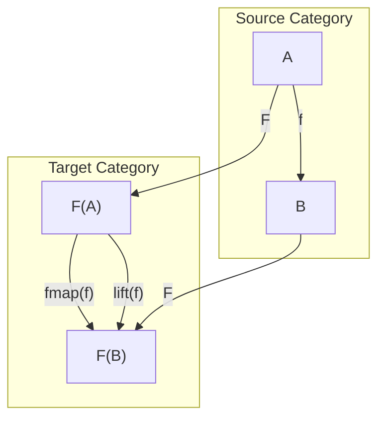
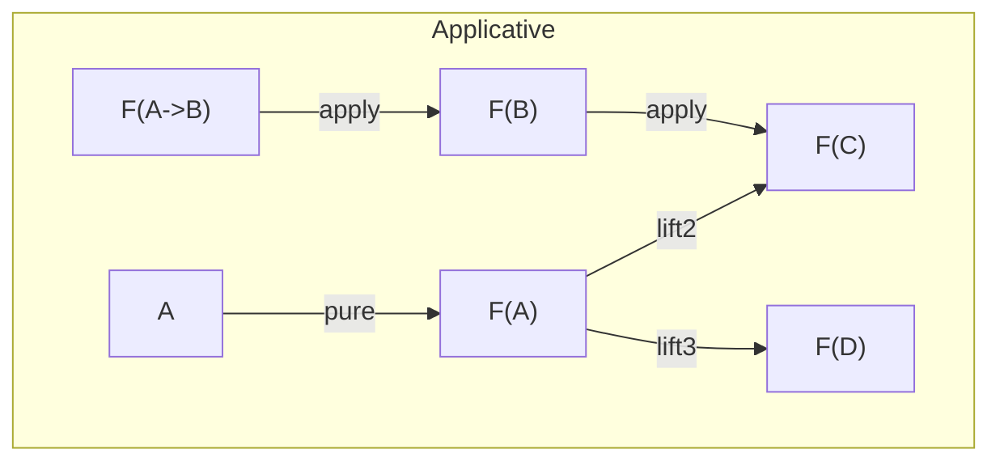
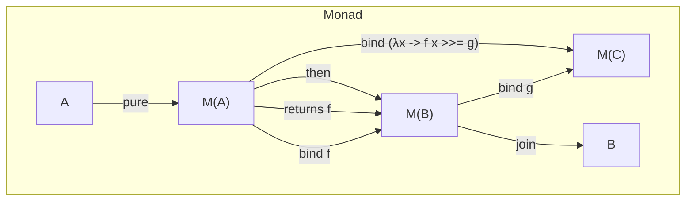

# Category Theory in Rustica

This document explains the core category theory concepts implemented in Rustica and their relationships.

## Type System Foundation

### Higher-Kinded Types (HKT)

The foundation of Rustica's type system is the `HKT` trait, which enables type-level programming:

```rust
pub trait HKT {
    type Output<U>: TypeConstraints where U: TypeConstraints;
}
```

All types in Rustica's functional abstractions must satisfy `TypeConstraints`:
- `Clone`, `PartialEq`, `Eq`, `Default`, `Send`, `Sync`, `'static`


```mermaid
flowchart TB
    subgraph "Trait Hierarchy"
        HKT["HKT"] --> Identity["Identity"]
        HKT --> Composable["Composable"]
        Identity --> Functor["Functor"]
        Identity --> Category["Category"]
        Composable --> Category
        Composable --> Arrow["Arrow"]
        Functor --> Applicative["Applicative"]
        Pure["Pure"] --> Applicative
        Applicative --> Monad["Monad"]
    end
```

## Core Abstractions

### Identity

The `Identity` trait represents the identity morphism in category theory:

```rust
pub trait Identity<T: TypeConstraints>: HKT {
    fn identity() -> Self::Output<T>;
    fn map_identity<U, F>(f: F) -> Self::Output<U>
    where
        U: TypeConstraints,
        F: FnTrait<T, U>;
}
```

Laws:
1. Identity: `identity().compose_with(f) = f = f.compose_with(identity())`
2. Naturality: `map_identity(f) = identity().fmap(f)`


```mermaid
flowchart LR
    subgraph Identity
        A["A"] --> |"identity()"| FA["F(A)"]
        A --> |"map_identity(f)"| FB["F(B)"]
    end
```

### Composable Functions

The `Composable` trait provides function composition capabilities:

```rust
pub trait Composable<T: TypeConstraints>: HKT {
    fn compose<U, V, F, G>(f: F, g: G) -> impl FnTrait<T, V>
    where
        U: TypeConstraints,
        V: TypeConstraints,
        F: FnTrait<T, U>,
        G: FnTrait<U, V>,

    fn compose_with<U, F>(self, f: F) -> Self::Output<U>
    where
        U: TypeConstraints,
        F: FnTrait<T, U>;
}
```

Laws:
1. Identity: `f.compose_with(identity()) = f = identity().compose_with(f)`
2. Associativity: `(f.compose_with(g)).compose_with(h) = f.compose_with(g.compose_with(h))`
3. Type Safety: `f: T -> U`, `g: U -> V`, then `f.compose_with(g): T -> V`


```mermaid
flowchart LR
    subgraph Function Composition
        T --> |"f"| U
        U --> |"g"| V
        T --> |"compose(f, g)"| V
        T --> |"compose_with(f)"| U
    end
```

### Category

A category in Rustica consists of:
1. Objects (Types satisfying `TypeConstraints`)
2. Morphisms (Functions between types)
3. Identity morphisms (via `Identity` trait)
4. Composition of morphisms (via `Composable` trait)

```rust
pub trait Category<T: TypeConstraints>: Identity<T> + Composable<T> {
    type Morphism<B, C>: FnTrait<B, C> where B: TypeConstraints, C: TypeConstraints;
    fn identity_morphism<B: TypeConstraints>() -> Self::Morphism<B, B>;
    fn compose_morphisms<B, C>(f: Self::Morphism<A, B>, g: Self::Morphism<B, C>) -> Self::Morphism<A, C>
    where
        B: TypeConstraints,
        C: TypeConstraints;
}
```


```mermaid
flowchart LR
    subgraph Category
        A["A"] --> |"identity_morphism()"| A
        A --> |"f: Morphism<A,B>"| B["B"]
        B --> |"g: Morphism<B,C>"| C["C"]
        A --> |"compose_morphisms(f, g)"| C
    end
```

### Functor

A functor maps between categories while preserving structure:

```rust
pub trait Functor<T>: HKT where T: TypeConstraints {
    fn fmap<U, F>(self, f: F) -> Self::Output<U>
    where
        U: TypeConstraints,
        F: FnTrait<T, U>;
    
    fn lift<U, F>(f: F) -> FnType<Self, Self::Output<U>>
    where
        U: TypeConstraints,
        F: FnTrait<T, U>;
}
```

Laws:
1. Identity: `fmap(identity) = identity`
2. Composition: `fmap(f.compose_with(g)) = fmap(f).compose_with(fmap(g))`
3. Structure Preservation: `fmap` must preserve container structure
4. Type Safety: `fmap` must maintain the same type constructor


```mermaid
flowchart TB
    subgraph "Source Category"
        A["A"] --> |"f"| B["B"]
    end
    subgraph "Target Category"
        FA["F(A)"] --> |"fmap(f)"| FB["F(B)"]
        FA --> |"lift(f)"| FB
    end
    A --> |"F"| FA
    B --> |"F"| FB
```

### Applicative

Applicative functors add the ability to apply functions within a context:

```rust
pub trait Applicative<T>: Functor<T> + Pure<T> where T: TypeConstraints {
    fn apply<U, F>(self, f: Self::Output<F>) -> Self::Output<U>
    where
        U: TypeConstraints,
        F: FnTrait<T, U>;

    fn lift2<B, C, F>(self, b: Self::Output<B>, f: F) -> Self::Output<C>
    where
        B: TypeConstraints,
        C: TypeConstraints,
        F: FnTrait<(T, B), C>;

    fn lift3<B, C, D, F>(
        self,
        b: Self::Output<B>,
        c: Self::Output<C>,
        f: F,
    ) -> Self::Output<D>
    where
        B: TypeConstraints,
        C: TypeConstraints,
        D: TypeConstraints,
        F: FnTrait<(T, B, C), D>;
}
```

Laws:
1. Identity: `pure(identity).apply(v) = v`
2. Composition: `pure(compose).apply(u).apply(v).apply(w) = u.apply(v.apply(w))`
3. Homomorphism: `pure(f).apply(pure(x)) = pure(f(x))`
4. Interchange: `u.apply(pure(y)) = pure(|f| f(y)).apply(u)`
5. Naturality: `fmap(f)(x.apply(y)) = x.apply(fmap(|g| f.compose_with(g))(y))`


```mermaid
flowchart TB
    subgraph "Applicative"
        A["A"] --> |"pure"| FA["F(A)"]
        FB["F(B)"] --> |"apply"| FC["F(C)"]
        FF["F(A->B)"] --> |"apply"| FB
        FA --> |"lift2"| FC
        FA --> |"lift3"| FD["F(D)"]
    end
```

### Monad

Monads add sequencing capabilities to applicative functors:

```rust
pub trait Monad<T>: Applicative<T> where T: TypeConstraints {
    fn bind<U, F>(self, f: F) -> Self::Output<U>
    where
        U: TypeConstraints,
        F: FnTrait<T, Self::Output<U>>;

    fn join<U>(self) -> Self::Output<U>
    where
        U: TypeConstraints,
        T: Into<Self::Output<U>>;

    fn returns<U, F>(self, f: F) -> Self::Output<U>
    where
        U: TypeConstraints,
        F: FnTrait<T, U>;

    fn then<U>(self, mb: Self::Output<U>) -> Self::Output<U>
    where
        U: TypeConstraints;
}
```

Laws:
1. Left Identity: `pure(x).bind(f) = f(x)`
2. Right Identity: `m.bind(pure) = m`
3. Associativity: `m.bind(f).bind(g) = m.bind(|x| f(x).bind(g))`
4. Join Consistency: `m.bind(f) = m.fmap(f).join()`
5. Pure Preservation: `join(pure(pure(x))) = pure(x)`
6. Returns: `m.returns(f) = m.bind(|x| pure(f(x)))`
7. Then: `m.then(n) = m.bind(|_| n)`


```mermaid
flowchart TB
    subgraph "Monad"
        A["A"] --> |"pure"| MA["M(A)"]
        MA --> |"bind f"| MB["M(B)"]
        MB --> |"bind g"| MC["M(C)"]
        MA --> |"bind (λx -> f x >>= g)"| MC
        MA --> |"returns f"| MB
        MA --> |"then"| MB
        MB --> |"join"| B["B"]
    end
```

## Example: Maybe Monad

The `Maybe` type is a classic example of a monad that handles optional values:

```rust
use rustica::datatypes::maybe::Maybe;
use rustica::traits::monad::Monad;
use rustica::traits::pure::Pure;
use rustica::fntype::FnType;

let x = Maybe::Just(3);
let f = FnType::new(|x| Maybe::Just(FnType::new(|x: i32| x + 1)));
let g = FnType::new(|x| Maybe::Just(FnType::new(|x: i32| x * 2)));

// Left identity
assert_eq!(Maybe::pure(3).bind(f.clone()), f.call(3));

// Right identity
assert_eq!(x.clone().bind(FnType::new(Maybe::pure)), x);

// Associativity
assert_eq!(x.clone().bind(f.clone()).bind(g.clone()), 
          x.bind(FnType::new(move |y| f.call(y).bind(g.clone()))));
```

This provides a safe and composable way to handle optional values and computations that may fail.

## Further Reading

- [Haskell's Category Theory](https://wiki.haskell.org/Category_theory)
- [Cats Documentation](https://typelevel.org/cats/)
