# Category Theory in Rustica

This document explains the core category theory concepts implemented in Rustica and their relationships.

## Core Concepts

### Category

A category consists of:
1. Objects (Types in Rustica)
2. Morphisms (Functions between types)
3. Identity morphisms
4. Composition of morphisms

```mermaid
graph LR
    A((A)) -- "id_A" --> A
    B((B)) -- "id_B" --> B
    A -- "f" --> B
    B -- "g" --> C((C))
    A -- "g ∘ f" --> C
```



### Functor

A functor F is a mapping between categories that preserves structure:
1. Maps objects to objects
2. Maps morphisms to morphisms
3. Preserves identity and composition

```mermaid
graph TB
    subgraph Category C
        A((A)) -- "f" --> B((B))
        A -- "id_A" --> A
        B -- "id_B" --> B
    end
    subgraph Category D
        FA((F(A))) -- "F(f)" --> FB((F(B)))
        FA -- "id_FA" --> FA
        FB -- "id_FB" --> FB
    end
```

### Monad

A monad is a functor with additional structure:
1. `return` (pure): A -> M(A)
2. `bind` (>>=): M(A) -> (A -> M(B)) -> M(B)

```mermaid
graph TB
    A((A)) -- "return" --> MA((M(A)))
    MA -- "bind f" --> MB((M(B)))
    A -- "f" --> MB
```

## Implementation in Rustica

### Core Traits


### Category Laws

1. Left Identity: `id . f = f`
2. Right Identity: `f . id = f`
3. Associativity: `(f . g) . h = f . (g . h)`


### Functor Laws

1. Identity: `fmap id = id`
2. Composition: `fmap (f . g) = fmap f . fmap g`

```mermaid
graph TB
    A((A)) -- "id" --> A
    FA((F(A))) -- "fmap id" --> FA
    A -- "g" --> B((B))
    B -- "f" --> C((C))
    FA -- "fmap (f . g)" --> FC((F(C)))
```

### Monad Laws

1. Left Identity: `return a >>= f = f a`
2. Right Identity: `m >>= return = m`
3. Associativity: `(m >>= f) >>= g = m >>= (\x -> f x >>= g)`

```mermaid
graph TB
    A((A)) -- "return" --> MA((M(A)))
    MA -- ">>= f" --> MB((M(B)))
    MB -- ">>= g" --> MC((M(C)))
    MA -- ">>= (\\x -> f x >>= g)" --> MC
```

## Examples

### Maybe Monad

```rust
use rustica::datatypes::maybe::Maybe;
use rustica::traits::monad::Monad;
use rustica::traits::pure::Pure;

let x = Maybe::Just(3);
let f = FnType::new(|x| Maybe::Just(FnType::new(|x: i32| x + 1)));
let g = FnType::new(|x| Maybe::Just(FnType::new(|x: i32| x * 2)));

// Left identity
assert_eq!(Maybe::pure(3).bind(f.clone()), f.call(3));

// Right identity
assert_eq!(x.clone().bind(FnType::new(Maybe::pure)), x);

// Associativity
assert_eq!(x.clone().bind(f.clone()).bind(g.clone()), x.bind(FnType::new(move |y| f.call(y).bind(g.clone()))));
```

## Further Reading

- [Haskell's Category Theory](https://wiki.haskell.org/Category_theory)
- [Cats Documentation](https://typelevel.org/cats/)
